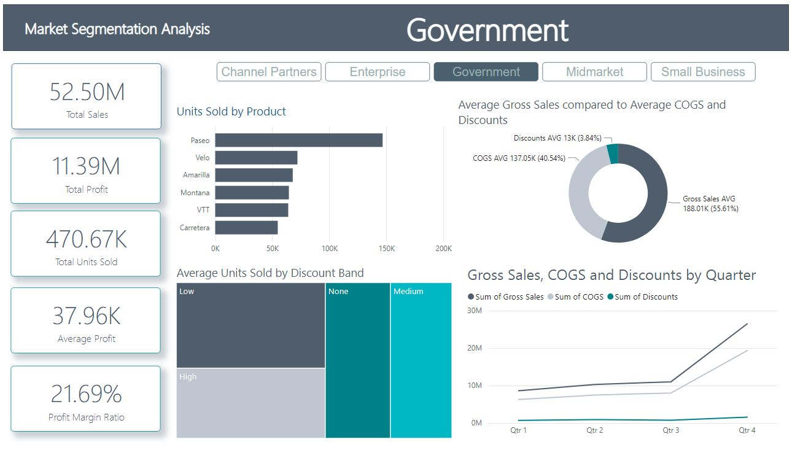

# Financials Market Segmentation Analysis (PowerBi Dashboard)

This Dashboard analyzes financial market segmentation, breaking it down in terms of sales, expenses, discounts, profit, units sold and products.
I have found some interesting insights I would love to share with you!!

Insights:

- <b>Government</b> segment has the <b>Highest Total Profit (11.4 M $)</b>
- Although <b>Small Business</b> segment being the most profitable having the <b>Highest Average Profit (44.43 K $)</b>
- <b>Channel Partenrs</b> segment has the <b>highest growth potential</b> with <b>Profit Margin Ratio = 73.13%</b>
- <b>Enterprise expenses (COGS) are very high compared to other segments</b>
- In addition to high expenses, <b>Discounts offered</b> made <b>Enterprise</b> segment <b>lose money (-ve profit, -ve profit margin ratio)</b>
- <b>Paseo</b> product is the <b>best-seller product over all segments</b>

------

The finincial data used in this project is provided by Microsoft Learn, PowerBI Samples [(Financial Sample)](https://learn.microsoft.com/en-us/power-bi/create-reports/sample-financial-download)
